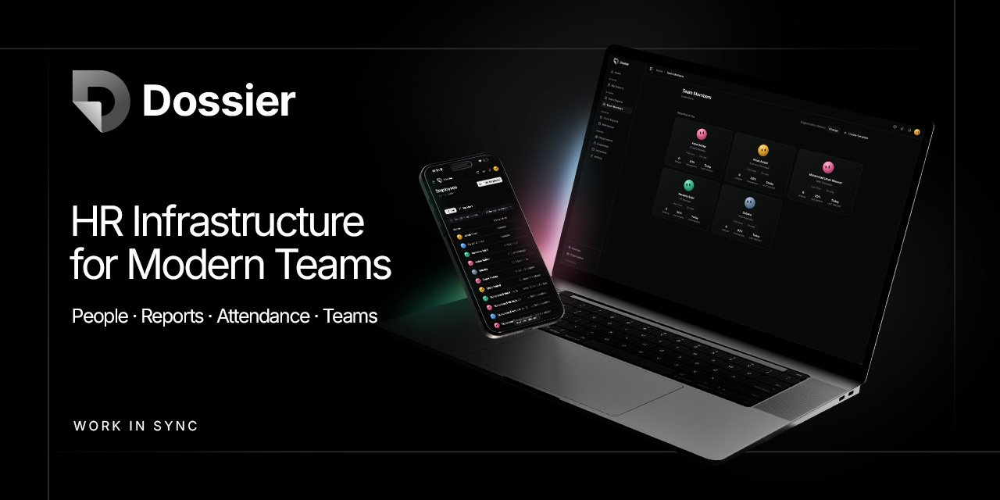
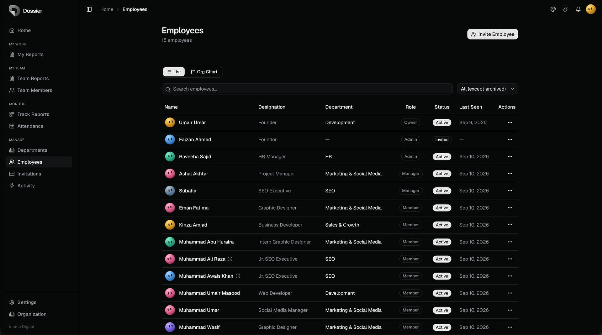
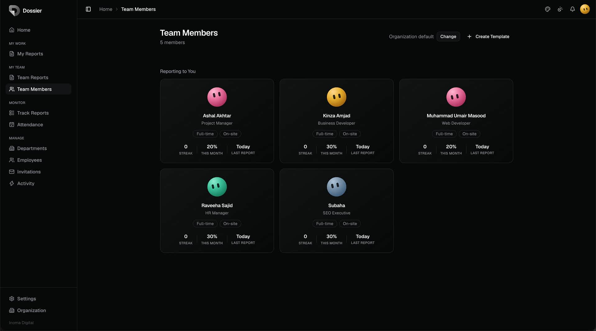
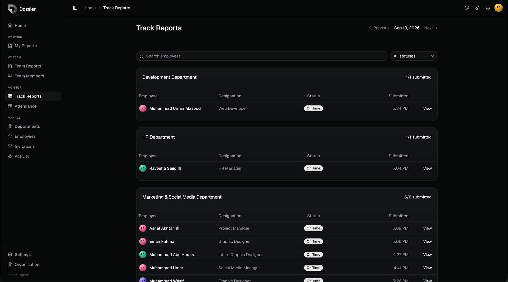
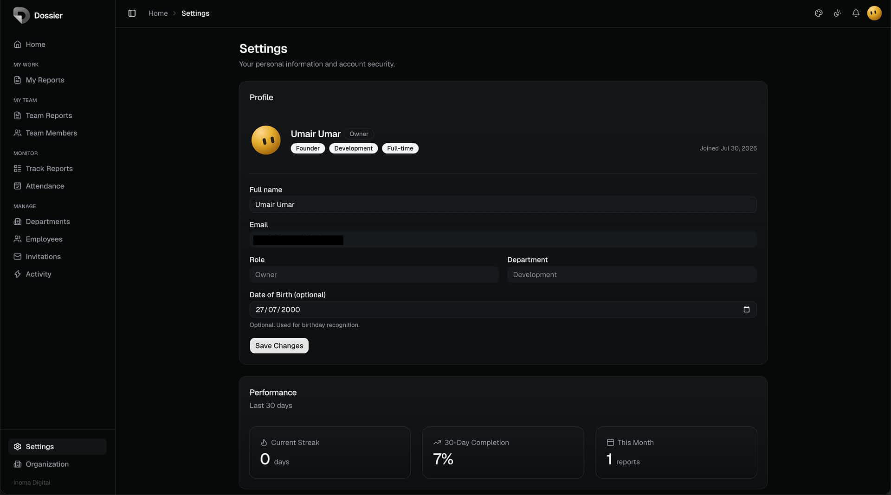

# Dossier

> HR infrastructure for modern teams.



Dossier is a full-stack internal HR platform built to manage people, track daily work, run attendance, and handle team operations — all in one place, with role-aware access at every level.

---

## Screenshots

<table>
  <tr>
    <td></td>
    <td></td>
  </tr>
  <tr>
    <td></td>
    <td></td>
  </tr>
</table>

---

## Stack

| Layer | Technology |
|---|---|
| Framework | Next.js 16 (App Router) |
| UI | React 19, TypeScript, Tailwind v4, shadcn/ui |
| Database | Supabase (PostgreSQL + Auth + RLS) |
| Font | Geist |
| Email | Resend |
| Deployment | Vercel |

---

## Features

### People
- Employee profiles, invite flow, onboarding, and role assignment
- Employment type (full-time / part-time), supervisor hierarchy, org chart
- Animated avatars — deterministic palette per employee, mouse-tracking on profile pages

### Reports
- Daily report submission with customizable templates per employee or department
- 6 field types: text, textarea, number, select, checkbox, URL
- Template inheritance: individual → department → org default
- Report history, search, and field-level preview

### Attendance
- Monthly grid with status chips and shift assignment
- Leave requests, leave balances, and monthly accrual
- Auto-attendance for remote employees on report submit
- Manager read-only view

### Team
- Team member cards with streak, submission rate, and last report stats
- Department profiles with completion trends and manager assignment
- Org chart with supervisor tree and department grouping

### Platform
- Role-based access: owner → admin → manager → member
- Activity log with 24 event types and actor/target tracking
- Notification system with bell, unread badge, and contextual triggers
- Dark theme with configurable accent color
- Breadcrumb navigation, indicator system, responsive layout

---

## Roles

| Role | Access |
|---|---|
| **Owner** | Full access, org settings, run accrual |
| **Admin** | Full access minus org settings |
| **Manager** | Own department views, read-only attendance |
| **Member** | Own reports and profile |

---

## Project Structure

```
app/                        # Next.js App Router — pages and layouts
components/                 # Shared and feature UI components
lib/                        # Server actions, Supabase clients, helpers
supabase/migrations/        # SQL migration files (applied manually)
types/                      # TypeScript types
scripts/                    # Ops and seeding utilities
docs/                       # Architecture, guidelines, and product docs
  assets/screenshots/       # README screenshots
  internal/                 # Roadmap, tech debt, QA (internal use)
proxy.ts                    # Next.js session middleware (Supabase SSR)
```

---

## Environment Variables

Copy `.env.example` to `.env.local` and fill in your values:

```bash
cp .env.example .env.local
```

All required variables and their descriptions are documented in `.env.example`.

---

## Development

```bash
npm install
npm run dev
```

After any code change, verify types:

```bash
npx tsc --noEmit
```

Migrations are SQL files in `supabase/migrations/` and are applied manually in the Supabase SQL Editor — never run programmatically.

To seed a demo environment:

```bash
SEED_ORG_SLUG=acme npx ts-node scripts/seed-demo.ts
```

---

## Documentation

| Doc | Purpose |
|---|---|
| [`docs/ARCHITECTURE.md`](./docs/ARCHITECTURE.md) | System architecture and data flow |
| [`docs/DATABASE.md`](./docs/DATABASE.md) | Schema overview and RLS policies |
| [`docs/PERMISSIONS.md`](./docs/PERMISSIONS.md) | Role permission matrix |
| [`docs/REPORT_SYSTEM.md`](./docs/REPORT_SYSTEM.md) | Template and report system deep-dive |
| [`docs/UI_GUIDELINES.md`](./docs/UI_GUIDELINES.md) | Design system and component conventions |
| [`docs/DEVELOPMENT_GUIDE.md`](./docs/DEVELOPMENT_GUIDE.md) | Local setup and contribution guide |
| [`docs/DEMO_SETUP.md`](./docs/DEMO_SETUP.md) | Seeding and running a demo environment |
| [`docs/EMERGENCY_RECOVERY.md`](./docs/EMERGENCY_RECOVERY.md) | Recovery procedures for production issues |

---

## License

Private. All rights reserved.
