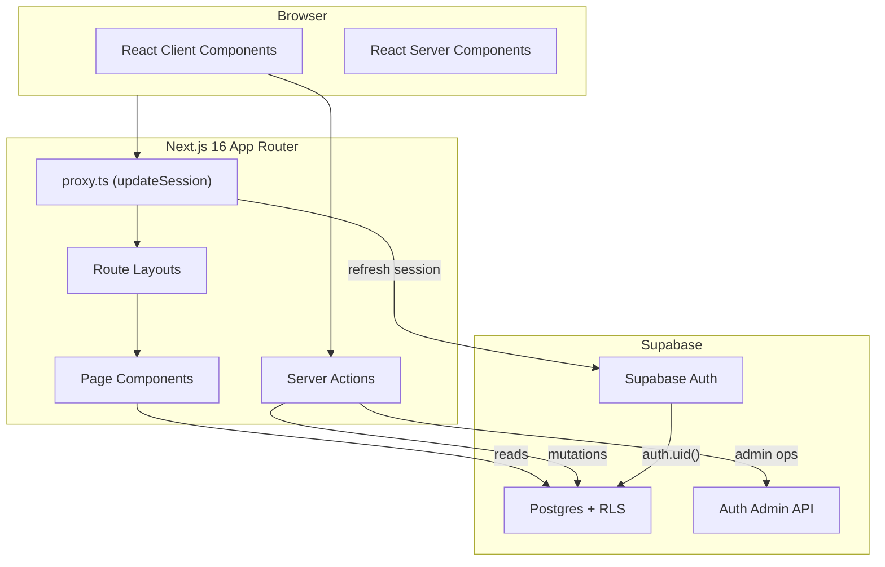
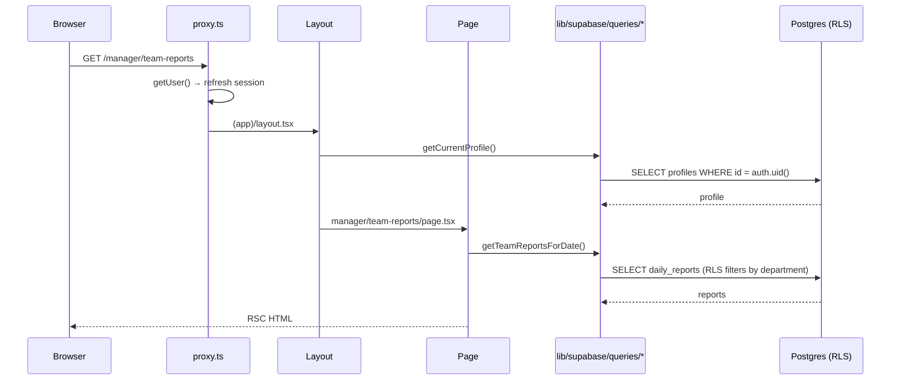
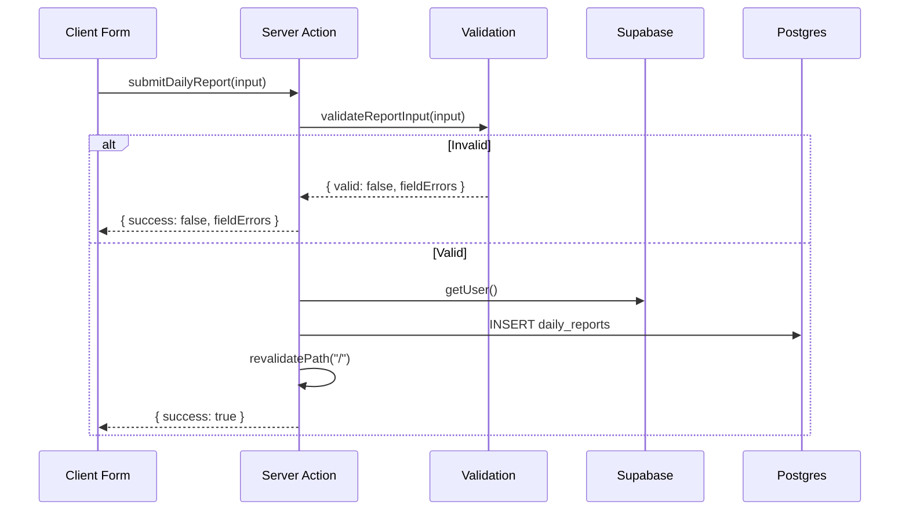

# Inoma Hub — Architecture Guide

## Overview

Inoma Hub is a Next.js 16 application using the App Router pattern with Supabase as the backend (Postgres + Auth + RLS). The architecture prioritizes **server components by default**, **RLS as the security boundary**, and **shared business logic** between client and server.

---

## System Architecture



---

## Folder Structure

```
inoma-hub/
├── app/
│   ├── (app)/                    # Authenticated routes (AppShell layout)
│   │   ├── layout.tsx            # Profile + active check → AppShell
│   │   ├── page.tsx              # Role-routed dashboards
│   │   ├── admin/                # Admin-only routes
│   │   │   ├── layout.tsx        # Role gate (UI only)
│   │   │   ├── employees/        # Employee management
│   │   │   ├── departments/      # Department management
│   │   │   ├── analytics/        # Org-wide trends
│   │   │   ├── invitations/      # Invitation tracking
│   │   │   ├── activity/         # Activity feed
│   │   │   └── settings/         # Org settings
│   │   ├── manager/              # Manager-only routes
│   │   │   ├── layout.tsx        # Role gate (UI only)
│   │   │   ├── team-reports/     # Date-filterable reports
│   │   │   ├── missing-reports/  # Who hasn't submitted
│   │   │   ├── team/             # Team roster
│   │   │   └── employees/[id]/   # Per-employee view
│   │   ├── reports/              # Employee report submission
│   │   │   ├── page.tsx          # Submit today's report
│   │   │   └── history/          # Personal history
│   │   └── settings/             # User settings (all roles)
│   │       ├── profile/          # Edit name
│   │       └── account/          # Change password
│   ├── (auth)/                   # Unauthenticated routes
│   │   ├── layout.tsx            # Centered card layout
│   │   ├── login/                # Email/password login
│   │   ├── invite/               # Invitation acceptance
│   │   ├── no-profile/           # Missing profile state
│   │   └── deactivated/          # Account disabled
│   ├── layout.tsx                # Root: fonts, theme, providers
│   └── globals.css               # Tailwind + custom CSS
├── components/
│   ├── ui/                       # shadcn/ui primitives
│   ├── layout/                   # AppShell, Sidebar, TopNav, NavConfig
│   ├── dashboard/                # Admin/Manager/Employee dashboards
│   ├── reports/                  # Report form, history, status cards
│   ├── manager/                  # Team reports, missing, highlights
│   ├── admin/                    # Employee/department sheets
│   ├── analytics/                # StatCard, ActivityFeed, trends
│   └── settings/                 # Profile form, password form
├── lib/
│   ├── actions/                  # Server Actions (mutations)
│   │   ├── auth.ts               # login, logout
│   │   ├── reports.ts            # submitDailyReport
│   │   ├── settings.ts           # updateOwnProfile
│   │   └── admin/                # Admin-only actions
│   ├── supabase/                 # Database layer
│   │   ├── server.ts             # createClient (anon + cookies)
│   │   ├── client.ts             # createClient (browser)
│   │   ├── admin.ts              # createAdminClient (service role)
│   │   ├── proxy.ts              # updateSession (middleware)
│   │   ├── require-admin.ts      # requireAdminUser() guard
│   │   └── queries/              # Cached query functions
│   ├── validations/              # Shared client/server validation
│   ├── helpers/                  # Pure functions (dates, stats, trends)
│   └── reports/                  # Report field metadata, status logic
├── types/                        # TypeScript interfaces
├── supabase/                     # Database
│   ├── migrations/               # Schema source of truth
│   └── seed.sql                  # Demo data
└── proxy.ts                      # Re-export for Next.js config
```

---

## Data Flow

### Read Path (Server Components)



### Write Path (Server Actions)



---

## Authentication Flow

```mermaid
flowchart TB
    subgraph Invite["Invitation Flow"]
        A1["Admin invites via generateLink()"] --> A2["Auth creates user + profile trigger fires"]
        A2 --> A3["Admin updates profile (role, department)"]
        A3 --> A4["User clicks invite link"]
        A4 --> A5["/invite exchanges token"]
        A5 --> A6["User sets password"]
        A6 --> A7["Redirect to /"]
    end
    
    subgraph Login["Login Flow"]
        L1["User visits /login"] --> L2["Submit email + password"]
        L2 --> L3["login() action → signInWithPassword()"]
        L3 --> L4["Redirect to /"]
    end
    
    subgraph Session["Session Refresh"]
        S1["Every request"] --> S2["proxy.ts → getUser()"]
        S2 --> |"expired"| S3["Refresh token"]
        S2 --> |"no user"| S4["Redirect to /login"]
        S2 --> |"valid"| S5["Continue to route"]
    end
```



---

## Authorization Flow

Authorization happens at **three levels**:

### Level 1: Proxy (Session)
`proxy.ts` ensures a valid session exists for all routes except `/login` and `/invite`.

### Level 2: Layouts (UI Gate)
Route layouts redirect non-matching roles:
- `(app)/layout.tsx`: Requires profile + `is_active`
- `admin/layout.tsx`: Redirects non-admins to `/`
- `manager/layout.tsx`: Redirects non-managers to `/`

### Level 3: RLS + requireAdminUser (True Boundary)
The database enforces all real access control:

```sql
-- Every user can read their own profile
create policy profiles_select_own on profiles for select
  using (id = auth.uid());

-- Managers can read their department's profiles  
create policy profiles_select_department_as_manager on profiles for select
  using (
    current_profile_role() = 'manager'
    and department_id = current_profile_department_id()
  );

-- Admins can read all profiles
create policy profiles_select_all_as_admin on profiles for select
  using (current_profile_role() = 'admin');
```

For admin mutations using the service-role client (which bypasses RLS), `requireAdminUser()` is called first:

```typescript
export async function requireAdminUser() {
  const supabase = await createClient();
  const { data: { user } } = await supabase.auth.getUser();
  
  if (!user) throw new Error("Not authenticated.");
  
  const { data: profile } = await supabase
    .from("profiles")
    .select("role")
    .eq("id", user.id)
    .maybeSingle();
    
  if (profile?.role !== "admin") throw new Error("Not authorized.");
  
  return user;
}
```

---

## RLS Philosophy

RLS policies in this application follow these principles:

1. **RLS is the security boundary** — layout redirects are UX conveniences
2. **Helper functions bypass RLS** — `current_profile_role()` and `current_profile_department_id()` are `SECURITY DEFINER` to avoid recursive evaluation
3. **Triggers enforce business rules** — Role/department changes require admin; manager_id must point to a manager
4. **No UPDATE/DELETE on reports** — Immutability enforced at the database layer
5. **Service role requires explicit guard** — Every use of `createAdminClient()` must call `requireAdminUser()` first

---

## Server Actions

All mutations flow through Server Actions in `lib/actions/`. The pattern:

```typescript
"use server";

export async function someAction(input: Input): Promise<Result> {
  // 1. Authorize (if admin-only)
  await requireAdminUser();
  
  // 2. Validate
  const validation = validateInput(input);
  if (!validation.valid) {
    return { success: false, fieldErrors: validation.fieldErrors };
  }
  
  // 3. Execute
  const supabase = await createClient();
  const { error } = await supabase.from("table").insert(...);
  
  if (error) {
    return { success: false, error: "Human-readable message." };
  }
  
  // 4. Revalidate cache
  revalidatePath("/affected/route");
  
  // 5. Return
  return { success: true };
}
```

### Action Inventory

| Action | File | Auth Level |
|--------|------|------------|
| `login`, `logout` | `auth.ts` | Public (login), Authenticated (logout) |
| `submitDailyReport` | `reports.ts` | Authenticated (RLS: own) |
| `updateOwnProfile` | `settings.ts` | Authenticated (RLS: own) |
| `inviteEmployee`, `updateEmployee`, etc. | `admin/employees.ts` | Admin (requireAdminUser) |
| `createDepartment`, `archiveDepartment`, etc. | `admin/departments.ts` | Admin |
| `updateReportDeadline` | `admin/organization-settings.ts` | Admin |

---

## Queries

All reads flow through cached query functions in `lib/supabase/queries/`. The pattern:

```typescript
import { cache } from "react";

export const getSomething = cache(async (): Promise<Thing | null> => {
  const supabase = await createClient();
  
  const { data: { user } } = await supabase.auth.getUser();
  if (!user) return null;
  
  const { data, error } = await supabase
    .from("table")
    .select("columns")
    .eq("condition", value);
    
  if (error) throw new Error("Human-readable message.");
  
  return data;
});
```

React's `cache()` deduplicates calls within the same request — layout and page can both call `getCurrentProfile()` without duplicate queries.

---

## Components

### Server Components (Default)
Most components are server components by default:
- Dashboards (`components/dashboard/*`)
- Page content
- Navigation (rendered in layout)

### Client Components (Interactive)
Components that need interactivity use `"use client"`:
- Forms with state
- Sheets/dialogs with open state
- Dropdowns/menus
- Toast triggers

The boundary is explicit: client components receive **serializable props** from server components, not functions.

---

## Dashboard Architecture

Home (`/`) renders one of three dashboards based on `profile.role`:

```typescript
export default async function DashboardPage() {
  const profile = await getCurrentProfileWithDepartment();
  
  if (profile.role === "manager") return <ManagerDashboard profile={profile} />;
  if (profile.role === "admin") return <AdminDashboard />;
  return <EmployeeDashboard profile={profile} />;
}
```

Each dashboard:
1. Fetches data in parallel with `Promise.all()`
2. Computes derived stats (streaks, completion %)
3. Renders stat cards, charts, and feeds using shared `components/analytics/*` primitives

---

## Report Architecture

### Report Flow
1. **Compose** — Employee fills `ReportForm` using field metadata from `REPORT_FIELDS`
2. **Validate** — Client validates for UX; server re-validates as source of truth
3. **Submit** — `submitDailyReport()` inserts via RLS (only own reports)
4. **Unique Constraint** — `(author_id, report_date)` prevents duplicate submissions
5. **Immutable** — No UPDATE/DELETE policies exist; history is permanent

### Submission Status
Three-state status evaluated against UTC deadline:
```typescript
export function getSubmissionStatus(
  submittedAt: string | null,
  deadlineHourUtc: number
): SubmissionStatus {
  if (!submittedAt) return "missed";
  return new Date(submittedAt).getUTCHours() >= deadlineHourUtc ? "late" : "on_time";
}
```

### Field Metadata
`lib/reports/fields.ts` centralizes field definitions for future configurability:
```typescript
export const REPORT_FIELDS: ReportFieldDefinition[] = [
  { key: "content", label: "Accomplishments", required: true, ... },
  { key: "blockers", label: "Blockers", required: false, ... },
  { key: "additional_notes", label: "Tomorrow's Plan", required: false, ... },
];
```

---

## Key Design Decisions

| Decision | Rationale |
|----------|-----------|
| **RLS over app-level auth** | Database is the single source of truth; app code can't accidentally bypass it |
| **Invitation-only signup** | Employees are added by admins, not self-registered |
| **Immutable reports** | Preserves accountability; no "editing away" mistakes |
| **UTC deadline** | Simple and consistent, though may add timezone setting later |
| **Service role is dangerous** | Explicitly documented; every use requires `requireAdminUser()` |
| **Capability nav** | Organizes by business capability (Reports, People), not role |
| **React `cache()`** | Deduplicates queries within a request without external state |
| **Home renders all dashboards** | One URL (`/`), role-based content; no redirects |
