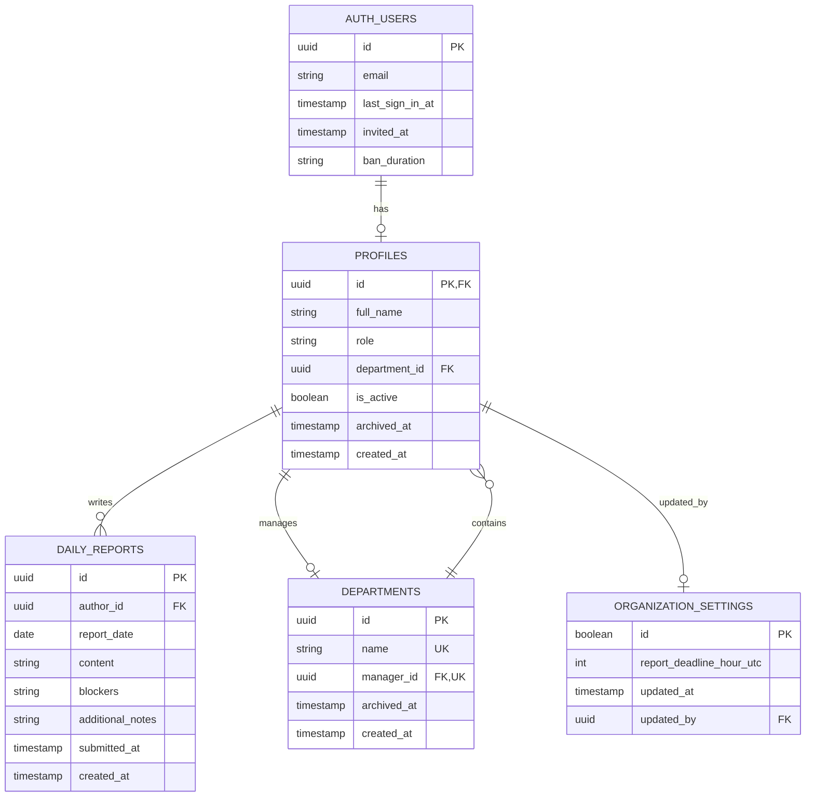

# Inoma Hub — Database Schema

## ER Diagram



---

## Tables

### `departments`

**Purpose:** Organizational units that scope manager visibility over employees and their reports.

| Column | Type | Nullable | Default | Description |
|--------|------|----------|---------|-------------|
| `id` | `uuid` | No | `gen_random_uuid()` | Primary key |
| `name` | `text` | No | — | Department name (unique) |
| `manager_id` | `uuid` | Yes | `null` | FK to profiles; must have role='manager' |
| `archived_at` | `timestamptz` | Yes | `null` | When archived (soft delete) |
| `created_at` | `timestamptz` | No | `now()` | Creation timestamp |

**Constraints:**
- `departments_name_key`: Unique name
- `departments_manager_id_key`: Unique manager_id (one department per manager)
- `departments_manager_id_fkey`: FK to profiles(id) ON DELETE SET NULL

**Triggers:**
- `departments_manager_role_check`: Ensures manager_id references a profile with role='manager'
- `departments_sync_manager_department`: When manager_id is set, updates that profile's department_id to match

**Indexes:**
- Primary key on `id`
- Unique on `name`
- Unique on `manager_id`

**Why It Exists:**
Departments are the fundamental organizational boundary. A manager's visibility is scoped to their department's employees and reports via RLS policies.

---

### `profiles`

**Purpose:** App-level identity extending auth.users with role and department assignment. Every RLS policy keys off this table.

| Column | Type | Nullable | Default | Description |
|--------|------|----------|---------|-------------|
| `id` | `uuid` | No | — | PK and FK to auth.users(id) |
| `full_name` | `text` | No | — | Display name |
| `role` | `text` | No | — | 'employee' \| 'manager' \| 'admin' |
| `department_id` | `uuid` | Yes | `null` | FK to departments; null for admins |
| `is_active` | `boolean` | No | `true` | Mirrors auth ban status |
| `archived_at` | `timestamptz` | Yes | `null` | When archived (soft delete) |
| `created_at` | `timestamptz` | No | `now()` | Creation timestamp |

**Constraints:**
- `profiles_pkey`: Primary key on id
- `profiles_role_check`: role IN ('employee', 'manager', 'admin')
- `profiles_department_id_fkey`: FK to departments(id) ON DELETE SET NULL

**Triggers:**
- `profiles_role_department_immutability`: Non-admins cannot change their own role or department_id

**Indexes:**
- Primary key on `id`
- `profiles_department_id_idx` on `department_id`

**Why It Exists:**
Supabase Auth (auth.users) stores authentication data but doesn't support custom fields. Profiles extend it with application-specific identity: role and department. The FK to auth.users with ON DELETE CASCADE means deleting an auth user cascades through profiles to all their reports.

---

### `daily_reports`

**Purpose:** One immutable end-of-day report per employee per day. This is the core entity of the system.

| Column | Type | Nullable | Default | Description |
|--------|------|----------|---------|-------------|
| `id` | `uuid` | No | `gen_random_uuid()` | Primary key |
| `author_id` | `uuid` | No | — | FK to profiles(id) |
| `report_date` | `date` | No | — | The date this report covers |
| `content` | `text` | No | — | "What did you work on today?" |
| `blockers` | `text` | Yes | `null` | Optional blockers |
| `additional_notes` | `text` | Yes | `null` | Tomorrow's plan |
| `submitted_at` | `timestamptz` | No | `now()` | When the report was submitted |
| `created_at` | `timestamptz` | No | `now()` | Row creation timestamp |

**Constraints:**
- `daily_reports_pkey`: Primary key on id
- `daily_reports_author_date_key`: Unique (author_id, report_date) — one report per person per day
- `daily_reports_author_id_fkey`: FK to profiles(id) ON DELETE CASCADE

**RLS Policies (critically, no UPDATE or DELETE):**
- `daily_reports_select_own`: Users can read their own reports
- `daily_reports_select_department_as_manager`: Managers can read their department's reports
- `daily_reports_select_all_as_admin`: Admins can read all reports
- `daily_reports_insert_own`: Users can insert reports for themselves

**Indexes:**
- Primary key on `id`
- `daily_reports_author_id_report_date_idx` on (author_id, report_date)
- `daily_reports_report_date_idx` on report_date (for date-based queries)

**Why It Exists:**
The daily report is the atomic unit of accountability. Immutability is enforced at the database layer (no UPDATE/DELETE policies) rather than just in application code. Department scoping is derived via author_id → profiles → department_id, not denormalized onto this table.

---

### `organization_settings`

**Purpose:** Singleton table holding organization-wide configuration. Currently stores only the report deadline hour.

| Column | Type | Nullable | Default | Description |
|--------|------|----------|---------|-------------|
| `id` | `boolean` | No | `true` | Always true (singleton pattern) |
| `report_deadline_hour_utc` | `smallint` | No | `17` | Hour (0-23) after which reports are "late" |
| `updated_at` | `timestamptz` | No | `now()` | Last update timestamp |
| `updated_by` | `uuid` | Yes | `null` | FK to profiles(id); who last changed it |

**Constraints:**
- `organization_settings_singleton`: CHECK (id) — ensures only one row
- `organization_settings_deadline_hour_range`: CHECK (report_deadline_hour_utc BETWEEN 0 AND 23)
- `organization_settings_updated_by_fkey`: FK to profiles(id) ON DELETE SET NULL

**RLS Policies:**
- `organization_settings_select_all_authenticated`: All authenticated users can read
- `organization_settings_update_as_admin`: Only admins can update

**Why It Exists:**
The report deadline was previously a hardcoded constant. This table makes it configurable. The singleton pattern (`boolean PRIMARY KEY CHECK(id)`) guarantees exactly one row exists.

---

## Functions

### `current_profile_role()`

```sql
create function public.current_profile_role()
returns text
language sql security definer stable
as $$
  select role from public.profiles where id = auth.uid();
$$;
```

**Purpose:** Returns the requesting user's role, bypassing RLS to avoid recursive policy evaluation. Used in RLS policies.

### `current_profile_department_id()`

```sql
create function public.current_profile_department_id()
returns uuid
language sql security definer stable
as $$
  select department_id from public.profiles where id = auth.uid();
$$;
```

**Purpose:** Returns the requesting user's department_id, bypassing RLS. Used in manager-scoped policies.

### `handle_new_user()`

```sql
create function public.handle_new_user()
returns trigger language plpgsql security definer
as $$
begin
  insert into public.profiles (id, full_name, role)
  values (
    new.id,
    coalesce(new.raw_user_meta_data ->> 'full_name', new.email, 'New user'),
    'employee'
  )
  on conflict (id) do nothing;
  return new;
end;
$$;
```

**Purpose:** Automatically creates a profile row when an auth.users row is inserted. Defaults to role='employee' with no department.

### `enforce_department_manager_role()`

**Purpose:** Ensures `departments.manager_id` points to a profile with role='manager'. Runs BEFORE INSERT/UPDATE on departments.

### `sync_manager_profile_department()`

**Purpose:** When a department's manager_id is set, updates that manager's profiles.department_id to match. This keeps RLS visibility in sync with the manager assignment.

### `enforce_profile_role_department_immutability()`

**Purpose:** Prevents non-admins from changing their own role or department_id. Runs BEFORE UPDATE on profiles.

---

## RLS Policies Summary

| Table | SELECT | INSERT | UPDATE | DELETE |
|-------|--------|--------|--------|--------|
| **profiles** | Own; Manager's dept; Admin all | *(trigger only)* | Own (limited); Admin all | — |
| **departments** | All authenticated | Admin | Admin | Admin |
| **daily_reports** | Own; Manager's dept; Admin all | Own only | **None** | **None** |
| **organization_settings** | All authenticated | — | Admin | — |

---

## Migrations

Migrations are applied chronologically and are the **source of truth** for the schema:

| Migration | Purpose |
|-----------|---------|
| `20260730120001_create_departments.sql` | Create departments table (manager_id FK added later) |
| `20260730120002_create_profiles.sql` | Create profiles table with role constraint |
| `20260730120003_link_departments_manager.sql` | Add manager_id FK + role enforcement trigger |
| `20260730120004_create_daily_reports.sql` | Create daily_reports with unique constraint |
| `20260730120005_enable_rls.sql` | Enable RLS + all policies + helper functions |
| `20260731130001_add_daily_report_fields.sql` | Add blockers and additional_notes columns |
| `20260731150001_auto_create_profile_on_signup.sql` | Add handle_new_user trigger |
| `20260731160001_sync_manager_department.sql` | Add manager→department sync trigger |
| `20260731170001_add_profile_active_status.sql` | Add is_active column |
| `20260801100001_add_archive_columns.sql` | Add archived_at to profiles and departments |
| `20260802100001_department_fk_set_null_on_delete.sql` | Change department_id FK to ON DELETE SET NULL |
| `20260803100001_organization_settings.sql` | Create organization_settings singleton |

---

## Design Notes

### Why Two FKs Between profiles and departments?

There are two relationships:
1. `profiles.department_id → departments.id` (which department does this person belong to?)
2. `departments.manager_id → profiles.id` (who manages this department?)

This creates a circular dependency that must be resolved with ordered migrations. It also requires PostgREST embed hints (`!profiles_department_id_fkey`) when joining.

### Why is report immutability in the database?

Reports cannot be edited or deleted via RLS policies — not even by admins. This ensures:
1. Accountability cannot be "edited away"
2. Historical integrity is preserved
3. The only way to remove reports is permanent employee deletion (cascade)

### Why does profiles have is_active when auth.users has ban_duration?

`ban_duration` is the enforcement mechanism (Auth rejects login). `is_active` is a query/display convenience mirroring that status, allowing filtering without calling the Auth Admin API.

### Why a singleton table for organization_settings?

A boolean primary key with CHECK(id) guarantees exactly one row. This is simpler than a key-value store for the small number of org-wide settings this app needs.
