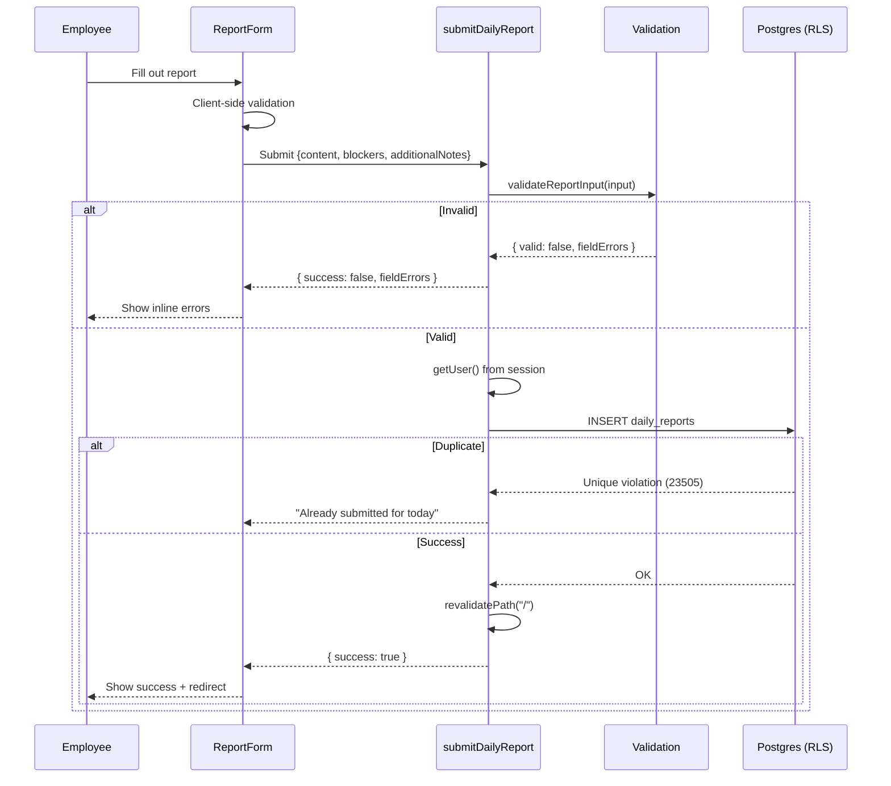

# Inoma Hub — Report System

## Overview

The daily report is the core entity of Inoma Hub. Each employee submits one report per day documenting their accomplishments, blockers, and plans. Reports are **immutable** — once submitted, they cannot be edited or deleted.

---

## Report Structure

### Current Fields

| Field | Database Column | Required | Max Length | Description |
|-------|-----------------|----------|------------|-------------|
| Accomplishments | `content` | Yes | 4,000 chars | What the employee worked on today |
| Blockers | `blockers` | No | 2,000 chars | Any obstacles encountered |
| Tomorrow's Plan | `additional_notes` | No | 2,000 chars | What they'll work on next |

### Field Metadata

Field definitions are centralized in `lib/reports/fields.ts`:

```typescript
export const REPORT_FIELDS: ReportFieldDefinition[] = [
  {
    key: "content",
    label: "Accomplishments",
    prompt: "What did you work on today?",
    required: true,
    order: 0,
  },
  {
    key: "blockers",
    label: "Blockers",
    prompt: "Blockers",
    required: false,
    order: 1,
  },
  {
    key: "additional_notes",
    label: "Tomorrow's Plan",
    prompt: "Tomorrow's Plan",
    required: false,
    order: 2,
  },
];
```

This allows forms and display components to read labels from a single source, preparing for future configurable templates.

---

## Submission Flow



### Step-by-Step

1. **User opens report form** — Client fetches today's report status
2. **Form renders** — Shows fields from `REPORT_FIELDS`, disabled if already submitted
3. **User fills form** — Client validates in real-time for UX
4. **User submits** — Form calls `submitDailyReport(input)`
5. **Server validates** — `validateReportInput()` checks required fields and lengths
6. **Server inserts** — RLS policy allows only `author_id = auth.uid()`
7. **Unique constraint** — `(author_id, report_date)` prevents duplicates
8. **Cache invalidation** — `revalidatePath("/")` refreshes dashboard
9. **Success feedback** — Toast + redirect to dashboard

---

## Validation

### Client-Side (UX)

```typescript
// Immediate feedback in the form
if (!content.trim()) {
  setError("Describe what you worked on today.");
}
if (content.length > REPORT_CONTENT_MAX_LENGTH) {
  setError(`Keep it under ${REPORT_CONTENT_MAX_LENGTH} characters.`);
}
```

### Server-Side (Source of Truth)

```typescript
export function validateReportInput(input: ReportFormInput): ReportValidationResult {
  const content = input.content.trim();
  const fieldErrors: ReportFieldErrors = {};

  if (!content) {
    fieldErrors.content = "Describe what you worked on today.";
  } else if (content.length > REPORT_CONTENT_MAX_LENGTH) {
    fieldErrors.content = `Keep it under ${REPORT_CONTENT_MAX_LENGTH} characters.`;
  }

  // Similar for blockers and additionalNotes...

  if (Object.keys(fieldErrors).length > 0) {
    return { valid: false, fieldErrors };
  }

  return {
    valid: true,
    value: {
      content,
      blockers: blockers || null,
      additionalNotes: additionalNotes || null,
    },
  };
}
```

### Constraints

| Field | Constraint | Error Message |
|-------|------------|---------------|
| content | Required | "Describe what you worked on today." |
| content | Max 4000 chars | "Keep it under 4000 characters." |
| blockers | Max 2000 chars | "Keep it under 2000 characters." |
| additionalNotes | Max 2000 chars | "Keep it under 2000 characters." |

---

## Storage

### Database Schema

```sql
create table public.daily_reports (
  id uuid primary key default gen_random_uuid(),
  author_id uuid not null references profiles(id) on delete cascade,
  report_date date not null,
  content text not null,
  blockers text,
  additional_notes text,
  submitted_at timestamptz not null default now(),
  created_at timestamptz not null default now(),
  
  constraint daily_reports_author_date_key unique (author_id, report_date)
);
```

### Key Design Decisions

1. **Immutability** — No UPDATE or DELETE RLS policies exist
2. **One per day** — Unique constraint on `(author_id, report_date)`
3. **Cascading delete** — Deleting the profile (via permanent delete) removes all reports
4. **UTC dates** — `report_date` is stored as UTC date, computed via `toISOString().slice(0, 10)`
5. **Separate timestamps** — `submitted_at` (user's action time) vs `created_at` (row creation)

### Indexes

```sql
-- Primary access pattern: user's own reports
create index daily_reports_author_id_report_date_idx 
  on daily_reports (author_id, report_date);

-- Manager pattern: all reports for a date
create index daily_reports_report_date_idx 
  on daily_reports (report_date);
```

---

## History

### Employee View

```typescript
export const getReportHistory = cache(async (): Promise<DailyReport[]> => {
  const { data } = await supabase
    .from("daily_reports")
    .select("id, author_id, report_date, content, blockers, additional_notes, submitted_at, created_at")
    .eq("author_id", user.id)
    .order("report_date", { ascending: false });
  return data;
});
```

Employees see all their past reports, newest first.

### Manager View

```typescript
export const getTeamReportsForDate = cache(async (date: string) => {
  const roster = await getTeamEmployeeRoster();
  const { data: reports } = await supabase
    .from("daily_reports")
    .select("...")
    .eq("report_date", date);
  
  // Join roster with reports
  return roster.map(employee => ({
    employeeId: employee.id,
    fullName: employee.full_name,
    report: reports.find(r => r.author_id === employee.id) ?? null,
  }));
});
```

Managers see all employees in their department with report status.

### Admin View

Admins can view any employee's report history via the employee detail page.

---

## Analytics

### Submission Status

Reports are classified into three states:

```typescript
export type SubmissionStatus = "on_time" | "late" | "missed";

export function getSubmissionStatus(
  submittedAt: string | null,
  deadlineHourUtc: number = 17
): SubmissionStatus {
  if (!submittedAt) return "missed";
  return new Date(submittedAt).getUTCHours() >= deadlineHourUtc ? "late" : "on_time";
}
```

| Status | Condition | Badge Color |
|--------|-----------|-------------|
| On Time | `submitted_at` hour < deadline | Green |
| Late | `submitted_at` hour ≥ deadline | Orange |
| Missed | No report for that date | Red |

### Report Stats

Computed per employee:

```typescript
export interface ReportStats {
  currentStreak: number;        // Consecutive days ending today
  reportsThisMonth: number;     // Count in current calendar month
  completionPercentage: number; // % of last 30 days with reports
  averageSubmissionTime: string | null; // Average UTC time
  lastSubmittedDate: string | null;
}
```

### Completion Trends

7-day and 30-day trends for managers and admins:

```typescript
export interface CompletionTrendPoint {
  date: string;              // "2026-08-01"
  completionPercentage: number; // 0-100
}
```

---

## Manager Review

### Team Reports Page

- Date picker to view any past date
- Table showing each employee with status badge
- Click row to expand report content
- Quick actions: view employee, send reminder (stub)

### Missing Reports Page

- List of employees who haven't submitted today
- Shows days since last submission
- Link to employee overview

### Report Detail Sheet

Slide-in panel showing:
- Employee name
- Submission time and status
- Full report content (Accomplishments, Blockers, Tomorrow's Plan)
- Link to employee's full history

---

## Admin Review

### Employee Detail Page

- Recent reports list (last 10)
- Total report count
- Full history accessible

### Organization Analytics

- 7-day and 30-day completion trends
- Percentage of active employees submitting on time
- Late submission counts

---

## Current Limitations

### No Editing

Reports cannot be edited after submission. This is intentional for accountability but may frustrate users who make typos.

**Future option:** Append-only amendments that preserve the original but allow corrections.

### No Deletion

Reports cannot be deleted by anyone. The only way to remove them is permanent account deletion (cascade).

### UTC-Only

The deadline and "today" are evaluated in UTC, not the organization's local timezone. An employee in San Francisco submitting at 6pm local time may be marked as "late" if the UTC deadline is 5pm (which is 10am in SF).

**Future option:** Organization-level timezone setting.

### No Templates

All employees use the same three fields. There's no way for admins to customize fields per department or role.

**Future option:** Configurable templates using the existing `REPORT_FIELDS` architecture.

### No Attachments

Reports are text-only. No file uploads or images.

### No Rich Text

Reports are plain text. No formatting, links, or markdown.

---

## Future: Configurable Report Templates

The architecture is prepared for configurable templates:

### Current State

```typescript
// Static array in lib/reports/fields.ts
export const REPORT_FIELDS: ReportFieldDefinition[] = [
  { key: "content", label: "Accomplishments", ... },
  { key: "blockers", label: "Blockers", ... },
  { key: "additional_notes", label: "Tomorrow's Plan", ... },
];
```

### Future State

```sql
-- New table
create table report_templates (
  id uuid primary key,
  name text not null,
  department_id uuid references departments(id), -- null = org-wide default
  fields jsonb not null, -- [{key, label, prompt, required, order}]
  created_at timestamptz default now()
);

-- Modified daily_reports
alter table daily_reports
  add column template_id uuid references report_templates(id),
  add column field_values jsonb; -- Dynamic field storage
```

### Migration Path

1. Create `report_templates` table
2. Seed with current `REPORT_FIELDS` as default template
3. Update `daily_reports` to reference template
4. Build admin UI for template management
5. Update form to read from template
6. Update display components to render dynamic fields

The existing `getReportField()` function and `REPORT_FIELDS` consumers already abstract the field source, minimizing changes needed in display components.
