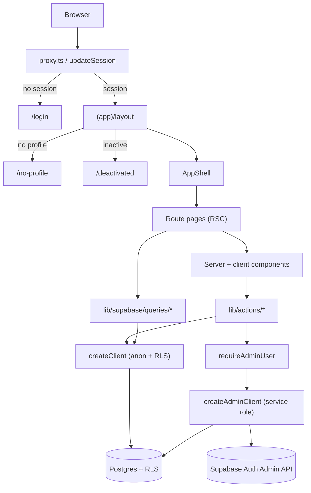
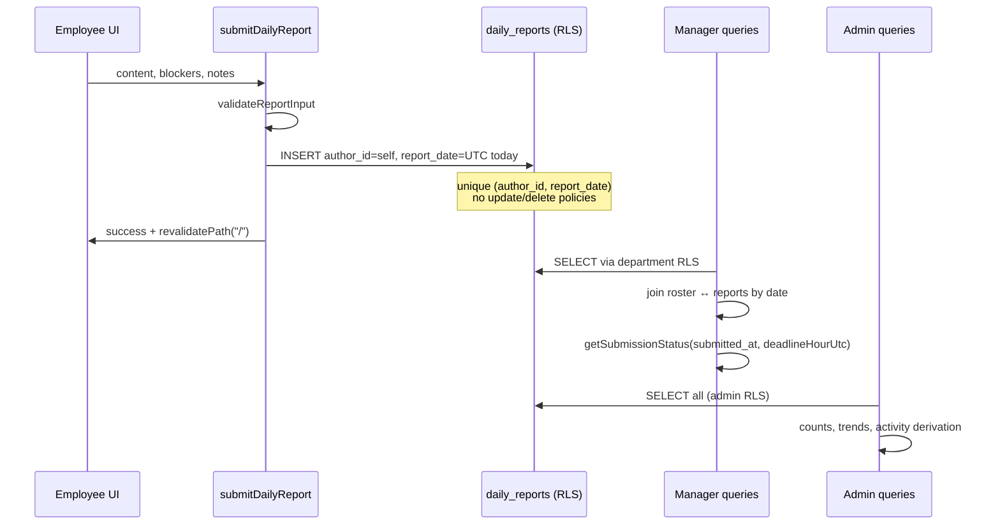

# Inoma Hub — Architecture Review

**Date:** 2026-08-01  
**Status reviewed:** Release Candidate 1 (v0.9.0 per `PROJECT.md`)  
**Scope:** Full codebase analysis. No application code was modified for this review.

---

## 1. Executive summary

Inoma Hub is a focused internal ops product: employees submit one immutable end-of-day report; managers review department completion; admins manage people, departments, and org settings.

The architecture is coherent and production-minded for an MVP:

- Next.js App Router with server components by default
- Supabase Auth + Postgres + Row Level Security as the real security boundary
- Clear separation of **pages → queries/actions → helpers → types**
- Capability-based navigation (not role-named nav sections)
- Documented trade-offs in code comments (especially around auth, invites, and RLS)

The main gaps are operational maturity (no tests, no generated DB types, empty scaffolding folders), a few consistency edges around timezones and role UX, and derived (non-persisted) activity feeds rather than a true audit log.

---

## 2. Project structure

```
inoma-hub/
├── app/
│   ├── (app)/              # Authenticated app shell (layout gates profile + active status)
│   │   ├── page.tsx        # Role-routed home dashboards
│   │   ├── admin/          # Admin-only routes (+ layout role gate)
│   │   ├── manager/        # Manager-only routes (+ layout role gate)
│   │   ├── reports/        # Employee report submit + history
│   │   └── settings/       # Profile + account (all roles)
│   ├── (auth)/             # Login, invite acceptance, no-profile, deactivated
│   └── layout.tsx          # Root: fonts, theme, accent, toaster
├── components/
│   ├── ui/                 # shadcn/ui primitives
│   ├── layout/             # AppShell, sidebar, nav config
│   ├── dashboard/          # Admin / Manager / Employee home UIs
│   ├── reports/            # Submit form, history, status cards
│   ├── manager/            # Team reports, missing, highlights
│   ├── admin/              # Employee/department management sheets
│   ├── analytics/          # Stat cards, trends, activity feed
│   └── settings/           # Profile + password forms
├── lib/
│   ├── actions/            # Server Actions (mutations)
│   ├── supabase/           # Clients, RLS-aware queries, requireAdmin
│   ├── validations/        # Shared client/server validation
│   ├── helpers/            # Dates, stats, trends, site URL
│   └── reports/            # Field metadata + submission status
├── types/                  # Domain TypeScript interfaces
├── supabase/migrations/    # Schema source of truth
├── docs/                   # Demo SQL + this review
└── proxy.ts                # Session refresh + auth redirects (Next.js 16)
```

**Empty / unused scaffolding:** `hooks/`, `services/`, `utils/`, and `lib/constants/` exist but contain no files. Logic lives under `lib/helpers`, `lib/actions`, and `lib/supabase` instead.

**Stack:** Next.js 16.2, React 19, TypeScript, Tailwind v4, shadcn/ui, Supabase SSR (`@supabase/ssr`), React Compiler enabled.

---

## 3. Architecture overview



### Layering model

| Layer | Responsibility | Location |
|---|---|---|
| Routing / UI gates | Redirects by session, profile, role | `proxy.ts`, route layouts |
| Presentation | Prefer RSC; client only for forms/sheets/menus | `app/`, `components/` |
| Mutations | Validate → authorize → write → revalidate | `lib/actions/` |
| Reads | Cached Supabase queries, often role-scoped via RLS | `lib/supabase/queries/` |
| Domain rules | Validation, streak/completion math, late/missed status | `lib/validations/`, `lib/helpers/`, `lib/reports/` |
| Persistence / security | Schema, triggers, RLS policies | `supabase/migrations/` |

### Design principles already reflected in code

1. **RLS is the security boundary**; route layouts are UX convenience only.
2. **Service-role client is dangerous by design** — every caller must `requireAdminUser()` first.
3. **Prefer server components**; `"use client"` is limited to interactive surfaces.
4. **Share validation** between client forms and server actions.
5. **One report per person per day**, immutable after insert (no UPDATE/DELETE policies).

---

## 4. Routing structure

Route groups `(app)` and `(auth)` share URL space but different layouts.

### Auth routes (`app/(auth)/`)

| Path | Purpose |
|---|---|
| `/login` | Email/password sign-in |
| `/invite` | Client-side invite token exchange + password setup |
| `/no-profile` | Signed in but missing `profiles` row |
| `/deactivated` | Profile exists with `is_active = false` |

### App routes (`app/(app)/`)

| Path | Roles (nav / layout) | Purpose |
|---|---|---|
| `/` | All | Role-specific dashboard |
| `/reports` | Employee (nav) | Submit today's report |
| `/reports/history` | Employee (nav) | Full personal history |
| `/manager/team-reports` | Manager | Date-filterable team reports |
| `/manager/missing-reports` | Manager | Who hasn't submitted today |
| `/manager/team` | Manager | Read-only roster |
| `/manager/employees/[id]` | Manager | Member overview |
| `/admin` | Admin | Same org overview as Home |
| `/admin/employees` | Admin | People list + invite/edit/archive |
| `/admin/employees/[id]` | Admin | Employee detail |
| `/admin/departments` | Admin | Department CRUD / archive |
| `/admin/invitations` | Admin | Invitation tracking |
| `/admin/analytics` | Admin | Org completion trends |
| `/admin/activity` | Admin | Derived activity feed |
| `/admin/settings` | Admin | Report deadline (UTC hour) |
| `/settings/profile` | All | Edit display name |
| `/settings/account` | All | Change password |

### Role gating pattern

1. **`proxy.ts`** — session required (except `/login`, `/invite`).
2. **`(app)/layout.tsx`** — profile required; inactive → `/deactivated`.
3. **`admin/layout.tsx` / `manager/layout.tsx`** — role redirect to `/` (UI only).
4. **RLS + `requireAdminUser()`** — actual authorization for data/mutations.

Home (`/`) switches dashboards in-page by `profile.role` rather than redirecting to `/admin` or `/manager`.

---

## 5. Authentication

### Flow

1. **Invitation-only** — no public sign-up. Admins use Auth Admin `generateLink({ type: "invite" })` so the invite URL is always available even without SMTP.
2. **Invite acceptance** — tokens often arrive in the URL hash (`#access_token=...`), which never reaches the server; `/invite` is therefore a client page that:
   - exchanges hash tokens via `setSession`, or PKCE `?code=` via `exchangeCodeForSession`
   - prompts for password via `updateUser({ password })`
   - hard-navigates to `/` so cookies are on the next RSC request
3. **Login** — server action `login` → `signInWithPassword` → redirect `/`.
4. **Logout** — server action `logout` → `signOut` → `/login`.
5. **Session refresh** — `proxy.ts` calls `getUser()` on each matched request (official Supabase SSR pattern).

### Profile bootstrap

Trigger `handle_new_user` on `auth.users` INSERT creates a `profiles` row (`role = 'employee'`, no department). Invite then updates role/department via the RLS-aware client.

Bootstrap of the first admin is manual (dashboard user + SQL `role = 'admin'`), documented in `README.md`.

### Deactivation / archive enforcement

| Mechanism | Role |
|---|---|
| Auth `ban_duration` | Real lockout (session/`getUser` fail) |
| `profiles.is_active` | Display + `(app)` layout redirect to `/deactivated` |
| `profiles.archived_at` | Soft-remove from org rosters/headcounts; still banned |

Archive and deactivate share the ban mechanism; archive additionally sets `archived_at` and excludes the person from active lists. Permanent delete removes the Auth user; profile and reports cascade.

### Auth-related edge cases handled well

- Avoids login↔home redirect loops for signed-in users without a profile (`/no-profile`).
- Keeps `/invite` reachable while a partial session exists after token exchange.
- Last-admin protections on demote / deactivate / archive / permanent delete.
- Self-demote / self-deactivate / self-archive blocked.

---

## 6. Role-based access (Admin, Manager, Employee)

### Capability matrix

| Capability | Employee | Manager | Admin |
|---|---|---|---|
| Submit own daily report | Yes (UI + RLS insert own) | Possible via RLS, **no nav** | Possible via RLS, **no nav** |
| View own report history | Yes | Via RLS own rows | Via RLS own rows |
| View department reports / roster | — | Yes (RLS by `department_id`) | Yes (all) |
| Invite / edit / archive people | — | — | Yes (service role + `requireAdmin`) |
| Manage departments | — | — | Yes |
| Org analytics / activity / settings | — | — | Yes |
| Change own name / password | Yes | Yes | Yes |

### How roles are enforced

1. **Database:** `profiles.role` check constraint; RLS policies call `current_profile_role()` / `current_profile_department_id()` (security definer helpers to avoid recursive RLS).
2. **Triggers:** Non-admins cannot change their own `role` / `department_id`; department `manager_id` must reference a manager; assigning a department manager syncs that manager's `profiles.department_id`.
3. **App:** Nav filtered by role; admin/manager layouts redirect; admin queries/actions call `requireAdminUser()`.
4. **Manager data access:** Intentionally relies on RLS — manager queries do **not** re-filter by department in SQL, and there is no `requireManagerUser()` helper (documented in `employee-overview.ts`).

### Navigation model

`components/layout/nav-config.tsx` groups by **business capability** (Reports, People, Organization, Settings). `AppShell` filters items by role and drops empty sections. This scales better than “Admin / Manager / Employee” nav trees.

### Important product nuance

Managers and admins are **not** offered Daily Report / History in the nav. RLS still allows inserting/selecting own reports, so a manager who needs to report must either be given a separate employee account or the product must later add dual-role / “managers also report” UX.

Team roster queries select `role = 'employee'` only — managers are overseers of a department’s employees, not members of the completion denominator.

---

## 7. Database schema (from migrations)

Migrations are ordered and well-commented. Applied chronologically:

### Tables

#### `departments`

- `id`, `name` (unique), `manager_id` (unique → one manager per department), `created_at`, `archived_at`
- FK `manager_id → profiles(id) ON DELETE SET NULL`
- Trigger: manager must have `role = 'manager'`
- Trigger: assigning manager syncs `profiles.department_id`

#### `profiles`

- `id → auth.users(id) ON DELETE CASCADE`
- `full_name`, `role` (`employee` \| `manager` \| `admin`)
- `department_id → departments(id) ON DELETE SET NULL`
- `is_active` (default true), `archived_at`, `created_at`
- Original “department required for non-admin” check was dropped so invites can land unassigned

#### `daily_reports`

- One row per `(author_id, report_date)` (unique)
- `content` (required), `blockers`, `additional_notes`
- `submitted_at`, `created_at`
- **No update/delete RLS policies** — immutability at the DB layer
- Indexes on `(author_id, report_date)` and `report_date`

#### `organization_settings`

- Singleton (`id boolean primary key check (id)`)
- `report_deadline_hour_utc` (0–23, default 17)
- `updated_at`, `updated_by`
- Select: all authenticated; update: admin only

### RLS summary

| Table | Select | Insert | Update | Delete |
|---|---|---|---|---|
| `profiles` | Own; manager’s department; admin all | None (trigger on signup) | Own (name etc.); admin all | — |
| `departments` | All authenticated | Admin | Admin | Admin |
| `daily_reports` | Own; manager via author’s department; admin all | Own only | **None** | **None** |
| `organization_settings` | Authenticated | — | Admin | — |

### Notable schema design choices

- Dual FKs between `profiles` and `departments` force PostgREST embed hints (`departments!profiles_department_id_fkey`).
- Manager visibility keys off **`profiles.department_id`**, not `departments.manager_id` — the sync trigger closes that gap.
- Permanent department delete requires archives first; employee FK uses `ON DELETE SET NULL` so deletes aren’t blocked by stale references.

---

## 8. Server actions, queries, and business logic

### Server actions (`lib/actions/`)

| Module | Operations |
|---|---|
| `auth.ts` | `login`, `logout` |
| `reports.ts` | `submitDailyReport` |
| `settings.ts` | `updateOwnProfile` |
| `admin/employees.ts` | Invite, update, activate/deactivate, archive/restore, permanent delete, resend invite |
| `admin/departments.ts` | Create/rename, assign manager, archive/restore, permanent delete |
| `admin/organization-settings.ts` | Update report deadline hour |

Pattern: `"use server"` → validate → authorize → mutate → `revalidatePath` → typed `{ success, error?, fieldErrors? }` result (except auth redirects).

### Queries (`lib/supabase/queries/`)

Wrapped in React `cache()` for request-level deduplication (layout + page both need profile, etc.).

| Area | Key functions |
|---|---|
| Profile | `getCurrentProfile`, `getCurrentProfileWithDepartment`, `getCurrentUserEmail` |
| Reports | `getTodayReport`, `getReportHistory` |
| Org settings | `getOrganizationSettings` |
| Manager | `getTeamEmployeeRoster`, `getTeamReportsForDate`, `getTeamInsights`, `getMissingReportsToday`, employee overview |
| Admin | `getAllEmployees`, `getEmployeeDetail`, departments, `getOrganizationSummary`, `getOrganizationTrends`, `getRecentActivity` |

Admin employee list merges `profiles` with Auth Admin `listUsers()` (paginated) because email / invite / last sign-in live on `auth.users`, not PostgREST.

### Shared business logic

| Concern | Location |
|---|---|
| Report field labels/prompts | `lib/reports/fields.ts` (`REPORT_FIELDS`) |
| On time / late / missed | `lib/reports/submission-status.ts` + org deadline |
| Streak / 30-day completion / avg time | `lib/helpers/report-stats.ts` |
| N-day completion trend series | `lib/helpers/completion-trend.ts` |
| Date “today” as `YYYY-MM-DD` UTC | `lib/helpers/dates.ts` (`todayDateString`) |
| Invite/employee/department validation | `lib/validations/*` |

### Client vs service-role usage

- **Anon/user client:** almost all reads and non-Auth writes (RLS applies).
- **Service role:** invite links, email changes, ban/unban, delete user, listing Auth users for admin UI.

---

## 9. How dashboards are built

Home (`app/(app)/page.tsx`) loads `getCurrentProfileWithDepartment()` and renders one of three server components:

### Employee dashboard

- Parallel: today’s report + full history
- `computeReportStats` → streak + monthly completion %
- Status card + submit card + recent preview (5) linking to history

### Manager dashboard

- Parallel: today’s team matrix, 90-day insights, org deadline
- Summary cards: size, submitted, missing, completion %, avg submit time, late count
- 7-day completion trend, streak / frequently-missing highlights, recent submissions feed
- Intentionally **does not** embed the interactive team table (that lives on Team Reports)

### Admin dashboard

- Parallel: org summary, recent activity (limit 8), departments (for invite sheet)
- Headcount stats + today’s org completion + pending invites + archived count
- Activity feed + quick actions (invite employee, create department)
- Same component reused at `/admin`

### Shared analytics primitives

`StatCard`, `CompletionTrendCard`, `ActivityFeed`, `MiniBarChart` under `components/analytics/` are reused across roles rather than duplicated per dashboard.

---

## 10. Report flow through the system



### End-to-end stages

1. **Compose** — `ReportForm` / sheets use `REPORT_FIELDS` for labels; client validates for UX.
2. **Submit** — `submitDailyReport` re-validates, inserts via user client, maps unique violation to a friendly error.
3. **Personal read** — today status + history for employee UI and stats.
4. **Manager review** — roster left-joined to reports for a date; status = on_time / late / missed vs org UTC deadline; missing-reports view adds last-submitted / days missed.
5. **Admin visibility** — org-wide counts and trends; employee detail can show report history.
6. **Immutability** — corrections are not supported; history is permanent unless the author is permanently deleted (cascade).

### Submission status semantics

- Evaluated in **UTC hour** against `organization_settings.report_deadline_hour_utc`.
- `null` submitted_at → `missed`; hour ≥ deadline → `late`; else `on_time`.
- “Today” for `report_date` is also UTC (`toISOString().slice(0, 10)`), so late evening in US timezones can roll the calendar day early relative to local intuition.

### Prepared extension point

`lib/reports/fields.ts` centralizes field metadata so a future configurable template can replace the static array without rewriting every display surface. Schema columns remain fixed today.

---

## 11. Architectural strengths

1. **Security model is honest and layered** — comments explicitly distinguish UI redirects from RLS / `requireAdminUser`.
2. **Migrations are the single schema source of truth**, with excellent rationale comments.
3. **Immutability of reports** enforced in Postgres, not only in app code.
4. **Invite UX is robust** without depending on SMTP (copyable `generateLink`).
5. **Request-level `cache()`** on hot queries avoids duplicate profile/report fetches.
6. **Capability nav** is a scalable IA choice.
7. **Shared math** (`computeReportStats`, completion trend builders) prevents drift across employee/manager/admin views.
8. **Account safety rails** for last admin and self-harmful admin actions.
9. **Prefer RSC** with a clear, limited client surface.
10. **Product scope is disciplined** — PROJECT.md non-goals match the code (no PM/HR/payroll/AI; reminders are placeholders).

---

## 12. Architectural weaknesses

### Security & authorization

1. **No `requireManagerUser()`** — manager routes trust layout + RLS. Correct if RLS stays perfect; weaker defense-in-depth than the admin pattern if a query is ever written with the service role or a policy regresses.
2. **Service-role blast radius** — any future import of `createAdminClient` without `requireAdminUser()` is a critical footgun (documented, but still easy to misuse).
3. **`is_active` vs ban can diverge** if one of the two updates fails mid-action (actions update Auth then profile sequentially without a compensating transaction).

### Data & consistency

4. **UTC-only “today” and deadline** — simple and consistent, but wrong for orgs that think in local business days / local 5pm.
5. **Dual relationship profiles↔departments** — ongoing PostgREST friction and cast workarounds (`as unknown as …`) without generated Database types.
6. **Invite status expiry (`24h`) is assumed**, not read from Auth project settings — “Pending” vs “Invited” can be wrong if Supabase config differs.
7. **Activity feeds are derived**, not an append-only audit log — restores, deactivations, deadline changes, role edits, etc. don’t appear; “department created” never ages out of the candidate set except via the final slice limit.

### Product / role model

8. **Managers/admins cannot submit reports via UI** despite RLS allowing own inserts — founders-as-admins and working managers fall through a UX gap.
9. **Send Reminder is a stub** — button exists but only toasts that nothing was sent (explicit non-goal, but the UI implies a feature).
10. **One department per manager** (unique `manager_id`) and one department per profile — no multi-team managers or matrix orgs.

### Operational maturity

11. **No automated tests** (no Vitest/Jest/Playwright in package.json).
12. **No generated Supabase TypeScript types** — query results rely on manual interfaces and casts.
13. **Empty scaffolding directories** (`hooks/`, `services/`, `utils/`, `lib/constants/`) add noise for newcomers.
14. **Admin employee list always pages Auth `listUsers`** — fine for small orgs; will degrade as headcount grows.
15. **Minor duplication** — `submitDailyReport` defines a local `todayDateString()` instead of always using `lib/helpers/dates`.
16. **No CI workflow visible in-repo** beyond local `tsc` / `eslint` / `build` docs in README.

### Observability & product polish

17. **No structured logging / error tracking** around invite/profile partial failures (“invitation created but role update failed”).
18. **Completion % denominators differ by view** (employee: 30 calendar days; manager today: active employees in dept; admin today: active employees org-wide) — correct for each screen but easy to misread when comparing numbers.

---

## 13. Suggested improvements

Prioritized for an RC → production hardening path. These are recommendations only; none were implemented in this review.

### High priority

1. **Generate and use Supabase Database types** (`supabase gen types`) to eliminate embed casts and catch column drift at compile time.
2. **Add a small automated test suite** — at least: `validateReportInput`, `getSubmissionStatus`, `computeReportStats`, last-admin guards (pure functions / action helpers).
3. **Make “reporting day” timezone-aware** (org setting: IANA timezone) so `report_date` and deadline match the business calendar.
4. **Decide manager/admin reporting UX** — either add Daily Report to those roles’ nav (same action) or document that reporting managers need an employee seat.
5. **Transactional or compensating flows** for ban + `is_active` / `archived_at` updates (rollback Auth ban if profile update fails, or vice versa).

### Medium priority

6. **Introduce `requireManagerUser()`** (or a shared `requireRole(...)`) mirroring admin, even when RLS remains primary.
7. **Persist an `activity_events` (or audit) table** written from server actions for reliable feeds and future compliance.
8. **Hide or relabel Send Reminder** until notifications exist, to avoid false expectations.
9. **Cache or denormalize Auth summary fields** needed for admin lists (email, invited_at, last_sign_in) onto `profiles` via trigger/webhook to avoid `listUsers` on every page load.
10. **Remove or populate empty top-level folders** so structure matches reality.

### Lower priority / later product

11. Configurable report templates (architecture already seeded via `REPORT_FIELDS`).
12. Email/push reminders for missing reports.
13. Soft-edit or “amendment” reports if ops needs corrections without breaking immutability of the original (append-only amendments).
14. Multi-department managers if the org structure requires it.
15. Wire CI (typecheck + lint + build + tests) on PRs.

---

## 14. Mental model (one paragraph)

Inoma Hub is a **role-scoped daily accountability loop** on top of Supabase: Auth identifies the user, `profiles` authorizes them, RLS scopes what they can read, and `daily_reports` records an immutable daily artifact. Dashboards are thin server compositions over shared query + helper modules; admin mutations escalate to the service role only after an explicit admin check. The codebase’s comments and migration history show deliberate evolution (invite loop fix, manager department sync, archive vs deactivate, org settings singleton) rather than accidental accretion — the next maturity step is types, tests, and timezone/role UX clarity, not a rewrite.

---

## 15. Suggested commit message (for this doc only)

```
docs: add architecture review of Inoma Hub MVP

Capture structure, auth/RBAC, schema, report/dashboard flows,
weaknesses, and prioritized improvements without changing app code.
```
